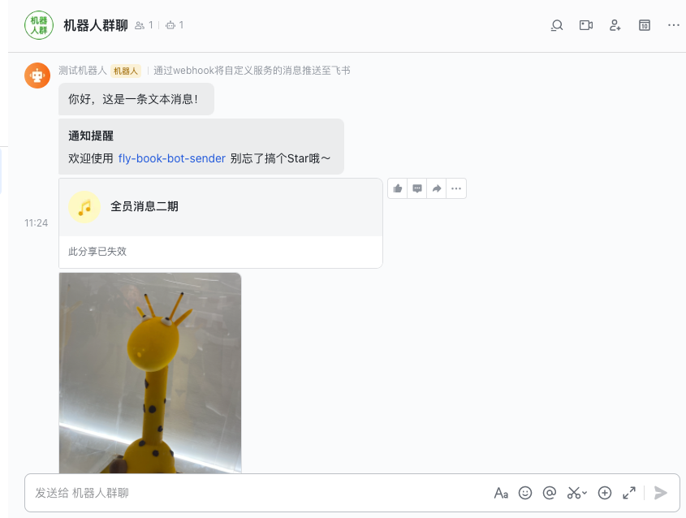
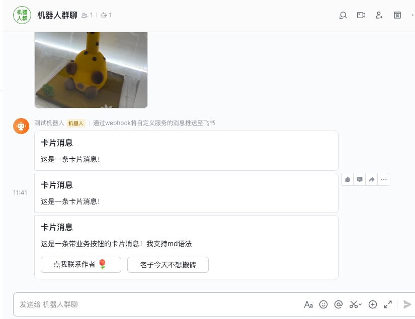
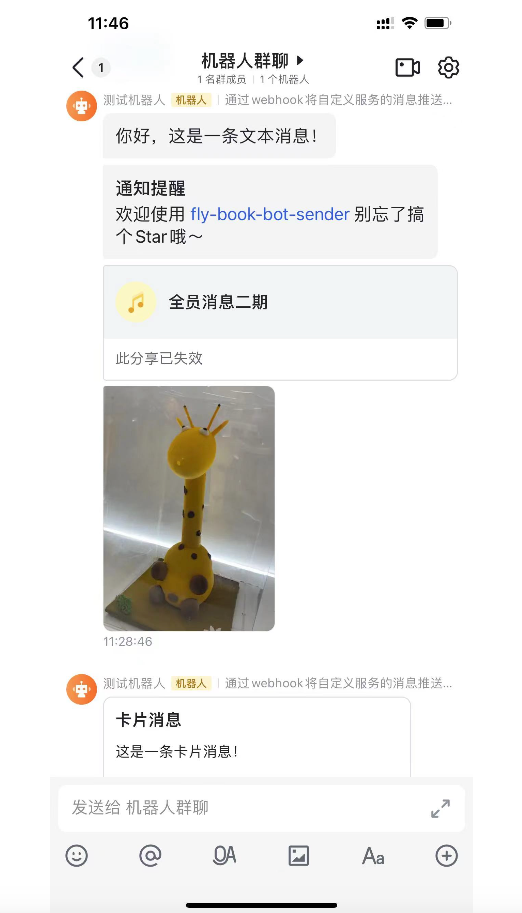
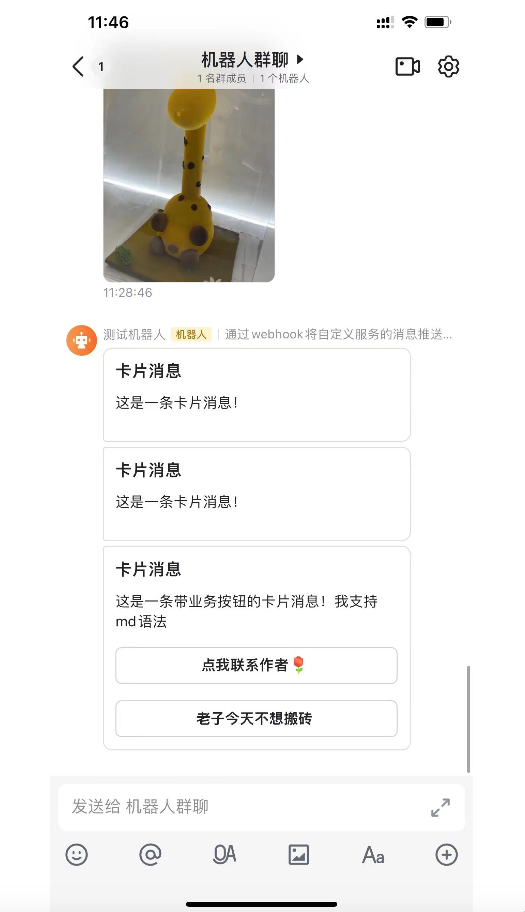

# 飞书自定义机器人消息发送工具

## 使用步骤

1. 安装库 [最新版本](https://pypi.org/project/fly-book-bot-sender)

```
pip install fly-book-bot-sender==0.1.7
```

2. [下载模板](https://download.fr71.com/open/template.zip) 放在项目根目录  
   

## 开始发送消息

1. 导入包

```
import fly_book_bot_sender as sender
```

2. 配置全局机器人hookApi地址(可选)

> 可选步骤，配置后无需在调用发送消息的api中携带该地址

```
# 配置全局使用的机器人消息发送api
sender.setHookUrl('机器人创建时生成的hookUrl')
```

## 发送消息与消息类型

- 文本消息

```
sender.sendChatMsg(msgType=sender.MSG_TYPE.TEXT,content='你好，这是一条文本消息！')
```

- 富文本消息

```
    sender.sendChatMsg(msgType=sender.MSG_TYPE.RICH_TEXT,
                       title='通知提醒',
                       content=[
                           {
                               'tag': 'text',
                               'text': '欢迎使用 '
                           },
                           {
                               'tag': 'a',
                               'text': 'fly-book-bot-sender',
                               'href': 'https://github.com/devzwy/FlyBookBotMsgSender'
                           },{
                               'tag': 'text',
                               'text': ' 别忘了搞个Star哦～ '
                           },
                       ]
                       )
```  

- 群名片消息

```
sender.sendChatMsg(msgType=sender.MSG_TYPE.GROUP_CARD, content='oc_f5b1a7eb27ae2c7b6adc2a74faf339ff')
```

- 图片消息

> 请求token->上传图片获得图片key->发送图片消息

```
    #获得token
    t = sender.getToken(app_id=APP_ID, app_secret=APP_SECRET)
    #获得图片id
    ik = sender.uploadImage('test.png', t)
    #发送消息
    sender.sendChatMsg(msgType=sender.MSG_TYPE.IMAGE, content=ik)
```

- 卡片消息

```
    # 不带按钮
    sender.sendChatMsg(msgType=sender.MSG_TYPE.CARD, title='卡片消息', content='这是一条卡片消息！')

    # 带按钮
    sender.sendChatMsg(msgType=sender.MSG_TYPE.CARD,
                       title='卡片消息',
                       content='这是一条带业务按钮的卡片消息！我支持md语法',
                       bottons=[
                           {
                               'bt_title': '点我联系作者:玫瑰:',
                               'href': 'https://github.com/devzwy'
                           },
                           {
                               'bt_title': '老子今天不想搬砖',
                               'href': 'https://baijiahao.baidu.com/s?id=1699508807181110630&wfr=spider&for=pc'
                           }
                       ])
```

## 效果预览
> 顺序对应以上类型  


### PC

  



### 手机
  


## 附

> sendChatMsg 函数回传一个长度=2的数组，第0位是bool值，代表发送的状态，第1位为str值，发送失败时返回原因，成功时返回定值：success


